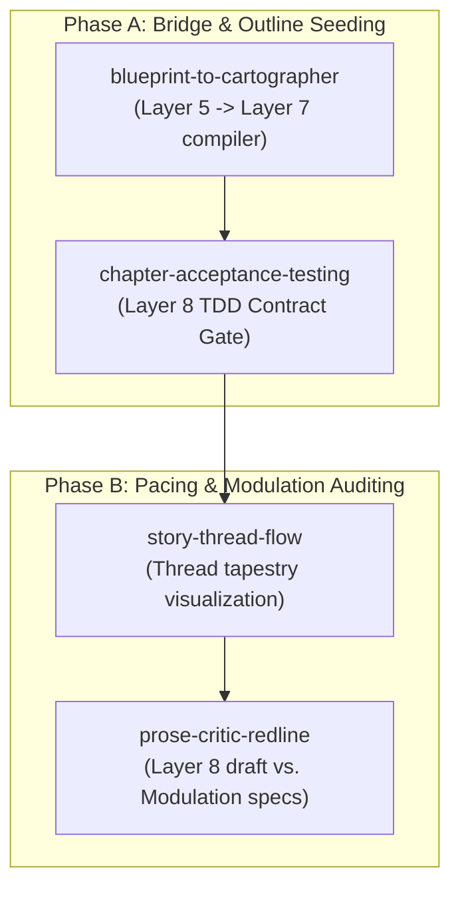

# PRD: Adapted Sensemaking & Interface Skills Ecosystem

**Status:** Approved (Conceptual Adaptation Phase)  
**Date:** 2026-05-18  
**Source:** Conceptual Adaptation of Sensemaking & Interface Skills to Auteur  

---

## 1. Problem Statement

Auteur excels at whole-story structural planning (Layers 1-5) and deterministic lore validation (Layer 6). However, a significant **cognitive and programmatic gap** exists when translating high-level structural constraints down to fine-grained chapter drafts:

1. **Blueprint translation is manual and error-prone**: Translating a 9-layer story blueprint into a sequence of concrete, act-bound chapters with correct subplots and POV assignments requires manual file structuring.
2. **Prose execution lacks test-driven gates**: There is no mechanism to define explicit "chapter contracts" (e.g., metric, spatial, and stylistic constraints) *before* drafting, making it difficult for prose critics to enforce TDD principles.
3. **Subplot pacing and style constraints are difficult to track**: Subplots are easily lost across acts, and style guides (modulation specifications) are frequently violated in raw drafts due to a lack of active comparison tools.

To bridge these gaps, Auteur adapts core concepts from the `sensemaking-skills` and `interface-skills` ecosystems to narrative engineering, creating a unified, developer-grade **Adapted Skill Ecosystem**.

---

## 2. The Adapted Skill Ecosystem

The ecosystem is divided into two distinct execution phases, ensuring high-fidelity progress from plan to outline and critique:



---

## 3. Phase A Specifications (High Priority)

### A. blueprint-to-cartographer (Outline Compiler)
- **Role**: Translates high-level structural forces, thread tapestry, and scope constants in `blueprint.yaml` (Layer 1-5) into a concrete sequence of **Cartographer Scene Cards** (Layer 7).
- **Interactive Sequence**:
  1. *Act Division*: Maps the story's act structure (Layer 3) to concrete chapter blocks based on pacing constraints.
  2. *Thread Distribution*: Weaves declared subplots (Layer 5) across chapter boundaries to balance pacing.
  3. *Carrier & POV Assignment*: Assigns character POV and location coordinates (Layer 6) per scene.
  4. *Compilation*: Programmatically writes the completed `cartographer_outline.yaml`.

### B. chapter-acceptance-testing (Chapter TDD)
- **Role**: Establishes explicit, machine-verifiable "chapter contracts" *before* drafting, creating the strict "contract gates" the drafting critics must pass.
- **Contract Schema (`chapter_contract.yaml`)**:
  - **Metrics**: Word count minimums/maximums, target pacing rate.
  - **State Transitions**: Validates target carrier states (e.g., Kael's location must transition from A to B).
  - **Required Elements**: Semantic assertions for clues, thematic reveals, or specific dialogues.
  - **Modulation**: Point-of-view constraints (e.g., third-person-limited) and style restrictions.

---

## 4. Phase B Specifications (Medium Priority)

### A. story-thread-flow (Tapestry Visualizer)
- **Role**: Maps the relationship graph between the Main Thread and Subplots across acts, visualizing want/resistance collisions, climax alignment, and emotional pacing.
- **Diagnostic Output**: A visual pacing report that flags "orphaned subplots" (threads left unresolved for too many chapters) or pacing dead-zones.

### B. prose-critic-redline (Style Critic)
- **Role**: Compares completed chapter prose directly against its `chapter_contract.yaml` modulation limits (vocabulary bans, active voice ratio, POV violations).
- **Output**: Generates a highlighted **Redline Mismatch Report** pointing out exactly where the prose drifts from style constraints, accompanied by recommended revision prompts.

---

## 5. User Stories

### Author Experience
1. **As an author**, I want to compile my whole-story blueprint into a complete, chapter-by-chapter outline automatically, so that I don't have to manually format scene files.
2. **As an author**, I want to set strict metrics and state transitions for a chapter *before* it is drafted, so that the AI draft engine is bound to a strict creative contract.
3. **As an author**, I want to visualize how my subplots intersect with my main plot across acts, so that I can ensure my pacing is balanced.
4. **As an author**, I want a detailed style redline comparing my draft prose to my style constraints, so that I can rapidly fix POV or vocabulary violations.

### Developer & Tooling Experience
5. **As an agent**, I want structured, standardized cognitive sequences in `skills/` to guide my outlining, TDD setup, and style audits.
6. **As a developer**, I want a unified validation framework where chapter contracts compile to Pydantic models, allowing deterministic CLI testing.

---

## 6. Directory Structure & Registries

All adapted skills are registered under Auteur's standard `skills/` directory structure, ensuring high discoverability for future agents:

```text
skills/
├── story-identity-architect/       # Concept Seeding (Layer 1-5)
├── structure-coherence-auditor/    # Blueprint Validation (Layer 1-9)
├── story-grill/                    # Narrative Stress-Testing (Layer 6-8)
├── blueprint-to-cartographer/      # Outline Compiler (Layer 5 -> Layer 7) [NEW]
└── chapter-acceptance-testing/     # TDD Contract Gate (Layer 8 TDD) [NEW]
```

---

## 7. Verification & Testing

- **Contract Validation**: All compiled contracts and outlines must validate against the Pydantic schemas defined in Auteur's structural model layer.
- **Regression Safety**: All additions remain entirely under `docs/` and `skills/` directories, ensuring that Auteur's unit tests (`pytest`) remain 100% green at all times.
