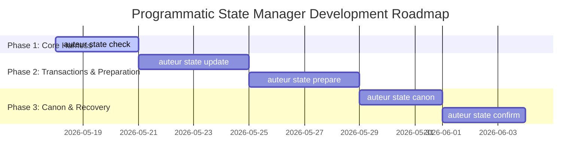

# PRD: Story State Commands — Programmatic CLI for the Story State Manager

## 1. Problem Statement

While the **Story State Manager (SSM)** is conceptually established and cognitively active through playbooks and agent skills, it lacks a dedicated programmatic CLI interface. Narrative engineers, continuous integration pipelines, and autonomous agent runners currently rely on separate commands, unstructured text parses, or manual file validations to inspect or modify the narrative.

To achieve robust, schema-safe bidirectional narrative engineering across all 9 structure layers, Auteur requires a programmatic, unified `auteur state` CLI command family.

---

## 2. Architectural Design & Physical Mapping

All commands operate on the project's canonical ledgers:
*   **blueprint.yaml**: Static engine parameters (Layers 1–5, 9).
*   **bible.json**: Live character and world entities database (Layer 6).
*   **outline.yaml**: Representation scene sequence mapping (Layer 7).
*   **structure/proposals/**: Audit history of resolved proposals.

---

## 3. Command Specifications

The CLI family will expose five core subcommands under the `auteur state` namespace:

### `1. auteur state check`
*   **Goal**: Provide a single, unified command to audit narrative coherence across the entire project repository.
*   **Behavior**:
    1. Executing this command triggers a complete dual-verification pass:
        *   **Structural Check**: Invokes the deterministic `auteur structure diagnose` pipeline on `blueprint.yaml` to detect gaps in structural forces, threads, or thematic logic.
        *   **Carrier Check**: Invokes the `auteur audit` pipeline on `bible.json` and `outline.yaml` to verify character state transition consistency (e.g. tracking physical, emotional, and location deltas across scenes).
    2. Outputs a unified, color-coded Markdown audit report of all contradictions, legacy terminology drift, or missing structural constraints.
    3. Exits with code `0` only if all layers are 100% clean and coherent.

### `2. auteur state update <file> --key <key> --val <value>`
*   **Goal**: Enable transactional, schema-safe mutations of project files.
*   **Behavior**:
    1. Parses the target project file (`blueprint.yaml` or `bible.json`).
    2. Validates that the requested `--key` path matches a valid attribute in the respective Pydantic model (e.g., `StoryBlueprint.story_engine.main_thread.want`).
    3. Mutates the model instance in memory, validates the mutated model using Pydantic's `.model_validate()`, and—if valid—writes the updated data back to disk in a single transactional step.
    4. **Safeties**: If Pydantic validation fails, the transaction is immediately rolled back, leaving the file completely untouched, and a detailed schema mismatch error is reported.

### `3. auteur state prepare <phase> --scope <scope> [--out <file>]`
*   **Goal**: Automate the compilation and formatting of phase handoff context packets.
*   **Behavior**:
    1. Target phases: `ideation`, `drafting`, `revision`, `recovery`.
    2. Target scopes: `engine`, `chapter`, `prose`.
    3. Reads `blueprint.yaml`, `bible.json`, and `outline.yaml` to extract the relevant context block fields.
    4. Generates the exact Markdown handoff template populated with real-time story data (e.g., active characters present, current want, setting constraints, downstream constraints).
    5. Saves the block to `--out` (default: stdout) for immediate ingestion by downstream agent chains.

### `4. auteur state canon [--format <format>]`
*   **Goal**: Generate a high-fidelity reference summary of characters, lore, and facts.
*   **Behavior**:
    1. Reads the entities database inside `bible.json`.
    2. Compiles a structured summary of all characters (including their final known location, physical state, emotional state, and active constraints), faction systems, and world lore.
    3. Supports formats: `markdown` (default) and `json`.

### `5. auteur state confirm <recovery_run.yaml>`
*   **Goal**: Automate the merging of confirmed layers from a recovery run.
*   **Behavior**:
    1. Parses a Story Recovery output file generated during Phase 0.
    2. Extracts the `candidate_locked_layers` specified by the author/agent.
    3. Safely validates and writes the approved layers directly into the respective models in `blueprint.yaml` or `bible.json` programmatically.

---

## 4. Development Roadmap

The development of the programmatic state namespace will follow a 3-phased implementation roadmap:

### Phase 1: Unified Verification (`check`)
*   Implement command harness in `auteur.cli`.
*   Integrate both the blueprint validator and bible-outline checker under `auteur state check`.
*   Write unit tests asserting proper stdout reports and process exit codes.

### Phase 2: Transactional Mutations & Compile (`update`, `prepare`)
*   Build deep-path reflection and parser inside `auteur.structure.analyzer`.
*   Add transactional write routines with safe rollback loops for `blueprint.yaml` and `bible.json`.
*   Establish the phase handoff compiler supporting `--scope` filters, mapping Pydantic values into templates automatically.

### Phase 3: Canon and Recovery Merge (`canon`, `confirm`)
*   Implement high-fidelity `markdown` and `json` canon generators from `bible.json`.
*   Create recovery proposal merge functions to parse Phase 0 output files, validate schema alignments, and write approved parameters.
