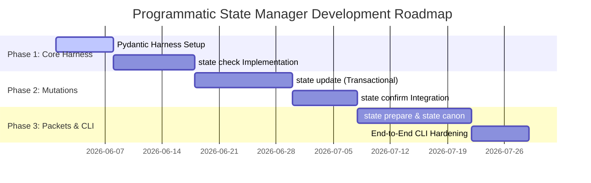

# Product Requirements Document (PRD) - programmatic 'auteur state' CLI

## 1. Goal & Context

As Auteur evolves into a powerful multi-layer story structure engine, the coordination between its **Brain** (cognitive LLM playbooks) and its **Worker** (deterministic programmatic CLI tools) must remain perfectly aligned. 

While the cognitive transitions are handled by the **Story State Manager Agent Skill**, the **deterministic mutations, cross-file verification checks, and handoff compilation** must be executed by a programmatic CLI namespace to prevent human/AI execution drift, preserve schema constraints, and secure transaction integrity.

This PRD formalizes the specifications and development roadmap for the new `auteur state` CLI command family.

---

## 2. Architectural Design & Physical Mapping

All commands operate on the project's canonical ledgers:
*   **blueprint.yaml**: Static engine parameters (Layers 1–5, 9).
*   **bible.json**: Live character and world entities database (Layer 6).
*   **outline.yaml**: Representation scene sequence mapping (Layer 7).
*   **structure/proposals/**: Audit history of resolved proposals.

---

## 3. Command Specifications

The CLI family will expose five core subcommands under the `auteur state` namespace:

### `1. auteur state check`
*   **Goal**: Provide a single, unified command to audit narrative coherence across the entire project repository.
*   **Behavior**:
    1. Executing this command triggers a complete dual-verification pass:
        *   **Structural Check**: Invokes the deterministic `auteur structure diagnose` pipeline on `blueprint.yaml` to detect gaps in structural forces, threads, or thematic logic.
        *   **Carrier Check**: Invokes the `auteur audit` pipeline on `bible.json` and `outline.yaml` to verify character state transition consistency (e.g. tracking physical, emotional, and location deltas across scenes).
    2. Outputs a unified, color-coded Markdown audit report of all contradictions, legacy terminology drift, or missing structural constraints.
    3. Exits with code `0` only if all layers are 100% clean and coherent.

### `2. auteur state update <file> --key <key> --val <value>`
*   **Goal**: Enable transactional, schema-safe mutations of project files.
*   **Behavior**:
    1. Parses the target project file (`blueprint.yaml` or `bible.json`).
    2. Validates that the requested `--key` path matches a valid attribute in the respective Pydantic model (e.g., `StoryBlueprint.story_engine.main_thread.want`).
    3. Mutates the model instance in memory, validates the mutated model using Pydantic's `.model_validate()`, and—if valid—writes the updated data back to disk in a single transactional step.
    4. **Safeties**: If Pydantic validation fails, the transaction is immediately rolled back, leaving the file completely untouched, and a detailed schema mismatch error is reported.

### `3. auteur state prepare <phase> --scope <scope> [--out <file>]`
*   **Goal**: Automate the compilation and formatting of phase handoff context packets.
*   **Behavior**:
    1. Target phases: `ideation`, `drafting`, `revision`, `recovery`.
    2. Target scopes: `engine`, `chapter`, `prose`.
    3. Reads `blueprint.yaml`, `bible.json`, and `outline.yaml` to extract the relevant context block fields.
    4. Generates the exact Markdown handoff template populated with real-time story data (e.g., active characters present, current want, setting constraints, downstream constraints).
    5. Saves the block to `--out` (default: stdout) for immediate ingestion by downstream agent chains.

### `4. auteur state canon [--format <format>]`
*   **Goal**: Generate a high-fidelity reference summary of characters, lore, and facts.
*   **Behavior**:
    1. Reads the entities database inside `bible.json`.
    2. Compiles a structured summary of all characters (including their final known location, physical state, emotional state, and active constraints), faction systems, and world lore.
    3. Supports formats: `markdown` (default) and `json`.

### `5. auteur state confirm <recovery_run.yaml>`
*   **Goal**: Automate the merging of confirmed layers from a recovery run.
*   **Behavior**:
    1. Parses a Story Recovery output file generated during Phase 0.
    2. Extracts the `candidate_locked_layers` specified by the author/agent.
    3. Safely validates and writes the approved layers directly into the respective models in `blueprint.yaml` or `bible.json` programmatically.

---

## 4. Development Roadmap

The development of the programmatic state namespace will follow a 3-phased implementation roadmap:

### Phase 1: Verification Harness & Unified Audit (Weeks 1–2)
*   Integrate CLI entry point for `auteur state`.
*   Implement `auteur state check` to run structural and carrier validations sequentially.
*   Enforce CI/CD check failure if `auteur state check` returns an exit code of `1`.

### Phase 2: Transactional Mutations & Confirms (Weeks 3–4)
*   Implement schema-safe, transactional writing via `auteur state update`.
*   Implement `auteur state confirm` to allow rapid recovery merging.
*   Write unit and integration tests under `tests/test_state_commands.py` with mock invalid data to ensure zero transaction leakage.

### Phase 3: Packets Generation & Canon Summary (Weeks 5–7)
*   Codify the handoff templating engine in `auteur state prepare`.
*   Implement `auteur state canon` to yield lore-reference reports.
*   Conduct exhaustive manual and automated QA passes to verify all CLI components.
