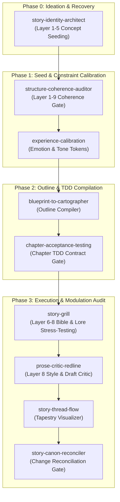

# Walkthrough: Adapted Skill Catalog & Narrative Engineering Lifecycle

This guide describes how to execute and compose Auteur's adapted narrative engineering skills. These skills adapt developer-grade software engineering patterns—such as ideation framing, design token systems, interface blueprints, spec testing, redlining, and change reconciliation—directly into long-form fiction writing.

---

## The Complete Narrative Engineering Lifecycle

Auteur sequences adapted skills across **4 Execution Phases**, moving logically from a blank page to completed, high-integrity drafts:



---

## 1. Skill Catalog & Directory Map

All active narrative engineering skills are located under the standard `skills/` directory structure, ensuring high discoverability for developers and AI agent runs:

| Phase | Skill Name | Path | Meta Goal | Primary Outputs |
| :--- | :--- | :--- | :--- | :--- |
| **Phase 0** | [story-identity-architect](file:///h:/GithubRepositories/auteur/skills/story-identity-architect/SKILL.md) | `skills/story-identity-architect/` | Resolves creative fog into high-level intent, medium, and scope bounds. | `story_identity.yaml` & `docs/story_identity_brief.md` |
| **Phase 1** | [structure-coherence-auditor](file:///h:/GithubRepositories/auteur/skills/structure-coherence-auditor/SKILL.md) | `skills/structure-coherence-auditor/` | Diagnoses whole-story blueprint coherence and acts boundaries. | Validated `blueprint.yaml` & `StructureDiagnostic` proposals |
| **Phase 2** | [blueprint-to-cartographer](file:///h:/GithubRepositories/auteur/skills/blueprint-to-cartographer/SKILL.md) | `skills/blueprint-to-cartographer/` | Translates blueprint subplots and constraints into concrete chapter blocks. | Compiled `cartographer_outline.yaml` scene outline |
| **Phase 2** | [chapter-acceptance-testing](file:///h:/GithubRepositories/auteur/skills/chapter-acceptance-testing/SKILL.md) | `skills/chapter-acceptance-testing/` | Establishes strict, testable "chapter contracts" (metrics, transitions) before drafting. | `chapter_contract.yaml` (TDD specifications) |
| **Phase 3** | [story-grill](file:///h:/GithubRepositories/auteur/skills/story-grill/SKILL.md) | `skills/story-grill/` | Interrogates proposed outlines/scenes against active carriers in the `StoryBible`. | Resolved outlines & inlined lore corrections (`StructureProposals`) |
| **Phase 3** | [prose-critic-redline](file:///h:/GithubRepositories/auteur/skills/prose-critic-redline/SKILL.md) | `skills/prose-critic-redline/` | Style-audits draft prose against contracts (POV, vocabulary, pacing). | High-contrast ANSI colored Redline Mismatch Reports |
| **Phase 3** | [story-thread-flow](file:///h:/GithubRepositories/auteur/skills/story-thread-flow/SKILL.md) | `skills/story-thread-flow/` | Visualizes character arcs, wanting shifts, and subplot pacing across acts. | Renderable Mermaid diagrams & Thread Tapestry reports |

---

## 2. Walkthrough by Execution Phase

### Phase 0: Concept Seeding & Fog Resolution
*   **The Brain (Agent)**: Initiates an interactive grilling loop. It asks exactly one question at a time to establish the emotional progression (Layer 1), genre constraints (Layer 2), scope limits (Layer 3), and core structural forces (Layer 4).
*   **The Worker (CLI)**: Compiles the approved decisions into a structured schema on disk:
    ```bash
    # 1. Validate the story identity schema
    auteur identity validate story_identity.yaml

    # 2. Compile/Seed the identity into a blueprint skeleton
    auteur blueprint seed story_identity.yaml --output blueprint.yaml
    ```

---

### Phase 1: Blueprint Validation & Coherence Check
*   **The Worker (CLI)**: Performs a deterministic whole-story check against the blueprint. If it detects a subplot exceeding its act budget or a missing thematic function, it throws a diagnostics exception:
    ```bash
    # Deterministically diagnose whole-blueprint coherence
    auteur structure diagnose blueprint.yaml
    ```
*   **The Brain (Agent)**: Parses the output diagnostics, compiles them into dual-choice **Decision Packets** (`StructureProposal` YAML files), recommends a resolution option, and interactively presents them to the author. Once approved, the changes are applied:
    ```bash
    # Apply selected proposal options to the blueprint
    auteur structure apply structure/proposals/repair_01.yaml blueprint.yaml
    ```

---

### Phase 2: Outline & TDD Spec Compilation
*   **The Worker (CLI)**: Compiles the high-level threads in the approved blueprint into a strict Outline Skeleton, distributing subplots and coordinate constraints:
    ```bash
    # Compile the blueprint into the scene outline
    auteur cartographer compile blueprint.yaml --output cartographer_outline.yaml
    ```
*   **The Brain (Agent)**: Collaborates with the author to enrich each outline card with wants/resistances, clues, and tones.
*   **The Worker (CLI)**: Generates the strict test specs (TDD contracts) for each chapter:
    ```bash
    # Deterministically validate outline continuity and transitions
    auteur cartographer validate cartographer_outline.yaml
    ```

---

### Phase 3: Drafting Critics & Continuity Audit
As drafting begins, Auteur's test critics ensure the prose remains 100% consistent with the Bible carrier states and style constraints:

#### Spatial & Inventory Audit
The CLI audits character coordinates (Layer 6) to detect anomalies (such as **Location Teleportation**):
```bash
# Traces Bible event logs and outlines to compile spatial/inventory drift
auteur audit <project_directory> --repair
```
If a character teleported or wielded an item locked in a different location, a proposal YAML is generated. The author resolves it:
```bash
# Accept travel scene or retroactive travel delta to align the Bible
auteur audit <project_directory> --accept repair_carriers_teleportation_kael --option add_travel_scene
```

#### Prose Style & Redlining
The drafting critic compares completed prose against its `chapter_contract.yaml`:

> **Roadmap command:** `auteur draft audit-style` is a planned CLI surface for deterministic style/redline audits. Until it is implemented, use the existing draft/critic pipeline outputs and proposal artifacts.

```bash
# Planned: deterministically audit active/passive verbs, POV, and vocabulary
auteur draft audit-style chapter_04_draft.txt --contract structure/contracts/chapter_04.yaml --output docs/reports/chapter_04_redline.md
```
The resulting output is printed in the terminal or saved as a high-contrast Markdown Redline (e.g., highlighting banned filter words or passive constructions in active scenes).

#### Thread Tapestry Visualizer
The author can inspect subplot progression and want/resistance collisions visually:

> **Roadmap command:** `auteur thread flow` is a planned CLI surface for Mermaid and density graph generation. The current repo provides the `story-thread-flow` skill playbook, but not this parser command.

```bash
# Planned: generate a Mermaid sequence diagram and ANSI density graph
auteur thread flow
```

---

## 3. Standard Schemas

### Chapter Contract Spec (`chapter_contract.yaml`)
```yaml
chapter_index: 4
act: "Act I"
title: "Whispers in the Dark"
metrics:
  word_count:
    min: 2200
    max: 2600
  active_verb_ratio_target: 0.70
carrier_state_transitions:
  - character: "Kael"
    field: "location"
    before: "Ruined Keep"
    after: "Dungeon Passages"
expected_reveals:
  - clue_id: "spies_guild_crest"
    description: "Kael discovers scouts wearing the crest."
modulation_constraints:
  pov_character: "Kael"
  banned_vocabulary:
    - "suddenly"
    - "realized"
    - "seemed"
```

### Redline Proposal (`prose_redline` StructureProposal)
```yaml
proposal_id: "repair_chapter_04_style_mismatch"
source_domain: "prose_redline"
layer: 8
finding: "Style Mismatch"
description: "Chapter 4 draft uses excessive passive verbs and banned vocabulary on line 45 and 112."
repair_options:
  - option_id: "apply_active_voice"
    summary: "Convert passive voice sentences on lines 45 and 112 to active voice."
    data:
      delta_type: "prose_correction"
      diff: |
        - He suddenly realized that the guards had already left the post.
        + The empty benches in the guard post confirmed his suspicion: they were gone.
  - option_id: "override_style"
    summary: "Keep the draft unchanged and override style warnings for this chapter."
    data:
      delta_type: "override"
      action: "accept_warnings"
selection:
  selected_option_id: null
decision:
  resolved_at: null
  author_notes: null
```

---

## 4. Best Practices for Developers and Agent Runs

1.  **Enforce Brain vs. Worker**: Always execute deterministic structural check operations via CLI commands (`auteur structure diagnose`, `auteur cartographer validate`, `auteur audit <project_directory> --repair`). Never write your own parsers to check location state transitions; trust Auteur's CLI checkers to print valid diagnostics.
2.  **Strict Error Separation**:
    *   **Deterministic Errors (Hard Gates)**: Treat as absolute blockers (CI/CD failures, agent execution stops).
    *   **Creative Mismatches (Soft Gates)**: Treat as Decision Packets requiring interactive sign-off.
3.  **Strict Terminology**: Always use correct domain terms:
    *   *Avoid*: `plot hole` or `continuity error` $\rightarrow$ *Use*: **Narrative Drift**.
    *   *Avoid*: `lore check` or `consistency scan` $\rightarrow$ *Use*: **Bible Audit**.
    *   *Avoid*: `spatial inconsistency` or `position jump` $\rightarrow$ *Use*: **Location Teleportation**.
    *   *Avoid*: `lore check` or `validator` $\rightarrow$ *Use*: **Structure Diagnostic**.
