# Story Thread Flow Skill

An agentic visual structure skill designed to map, trace, and analyze the emotional pacing, tension progression, and subplot intersections between the Main Thread and Subplots (Layer 5) across chapter cards, ensuring balanced pacing and flagging orphaned threads.

## Meta
- **Name**: story-thread-flow
- **Goal**: Audit and optimize the weave of subplots and main threads across the act structure to prevent pacing dead-zones.
- **Output**: A comprehensive visual pacing report identifying thread densities, tension peaks, and subplot orphans.

---

## 1. Cognitive Architecture: Brain vs. Worker

When executing this skill, the agent functions as the **Brain (Cognitive Orchestrator)** while the Auteur CLI operates as the **Worker (Deterministic Executor)**.

- **The Brain (You)**: Evaluates thematic pacing progression, balances character want/resistance collisions across act divisions, identifies pacing dead-zones (where no subplots are active), ensures subplots build to unified thematic climaxes, and interactively grills the author on narrative pacing issues.
- **The Worker (CLI)**: Compiles thread lists per chapter, builds adjacency and intersection matrices, checks transition events, and generates parseable visual diagrams (such as Markdown tables or Mermaid graphs).

---

## 2. The Interactive Pacing Analysis Loop

The agent must walk the author through a strict **5-Phase Sequence** to analyze the pacing flow:

### Phase 1: Context Hydration
Before executing any analysis, load the planning files:
1. Parse the thread list and scene structures from `blueprint.yaml` and `cartographer_outline.yaml`.
2. Extract the Want, Resistance, and Conflict metrics of each scene (Layer 7).

### Phase 2: Subplot Tapestry Sweep
Trace the physical footprint of each thread across the chapters:
1. Count the scene frequencies of each subplot.
2. Compile a chapter-by-thread grid mapping where each thread is active.
3. Identify the gaps between subplot scenes.

### Phase 3: Emotional Tension & Pacing Audit
Evaluate the narrative tension curves across act boundaries:
1. Map each scene's stakes to a tension scale (e.g., Low, Medium, High, Climax).
2. Trace the pace shifts (fast scenes vs. slow scenes) to ensure appropriate recovery beats exist after heavy action climaxes.
3. **Ask One Question**: *"Your outline contains a sequence of four 'High-Tension' active combat scenes in Chapters 11-14 with no reflective rest beats. We recommend converting Chapter 13 into a slow-paced recovery beat focusing on Kael and Lira's motivation. Do you approve?"*
4. **Wait for Approval** before adjusting chapter pacing.

### Phase 4: Orphans & Dead-Zone Detection
Identify structural gaps:
*   **Orphaned Subplots**: Threads that are introduced but receive no active scenes for more than 5 consecutive chapters.
*   **Pacing Dead-Zones**: Sequences of chapters where only the main thread is active with no subplot movement, causing structural fatigue.
*   **Ask One Question**: *"Your subplot 'The Spies Guild' is active in Chapter 4, but has no presence until Chapter 15. This 11-chapter gap is a 'Pacing Dead-Zone' where the reader will lose track of the intrigue. We recommend adding a small suspense beat in Chapter 9. Do you approve?"*
*   **Wait for Approval** before adding the thread coordinate.

### Phase 5: Report Compilation
Once pacing issues are resolved or cataloged, compile the final pacing report and generate the visual Mermaid flowchart of the thread tapestries:

> **Roadmap command:** `auteur cartographer analyze-flow` is a planned CLI surface. The current repo has the skill workflow but not this parser command.

```bash
auteur cartographer analyze-flow cartographer_outline.yaml --output docs/reports/pacing_flow.md
```

---

## 3. Diagnostic Pacing Report Schema

The skill outputs a fully parsed pacing report combining metrics, structural diagnoses, and visual flowcharts:

```markdown
# Narrative Pacing & Thread Flow Audit

## 1. Thread Densities & Gaps

| Thread ID | Scene Count | Max Gap (Chapters) | Status |
|---|---|---|---|
| `main_thread` | 24 / 24 | 0 | **Healthy** |
| `spies_guild_subplot` | 3 / 24 | 11 | **Warning (Dead-Zone)** |
| `lira_romance_subplot` | 5 / 24 | 3 | **Healthy** |

## 2. Structural Pacing Diagram (Mermaid)

```mermaid
gantt
    title Subplot Tapestry Grid
    dateFormat  X
    axisFormat %s
    section Main Thread
    Intro Beat (Ch 1-3) :active, 1, 3
    Midpoint Escalation (Ch 10-12) : 10, 12
    Climax (Ch 22-24) : 22, 24
    section Spies Guild Subplot
    Guild Crest Found (Ch 4) : 4, 4
    Treason Revealed (Ch 15) : 15, 15
    Infiltrate Outpost (Ch 20) : 20, 20
```



## 3. Pacing Violations Log

- **[VIOLATION - Tier 2] Pacing Dead-Zone (Chapters 5-14)**: The `spies_guild_subplot` is inactive for 11 consecutive chapters, risking narrative irrelevance.
- **[VIOLATION - Tier 3] Tension Spike (Chapters 11-14)**: Four consecutive combat climaxes lack intermediate pacing recovery beats, risking reader exhaustion.
```

---

## 4. CLI Visualization & Audit Commands

The planned worker pacing analyzer command is:

```bash
# Planned: analyze thread gaps and pacing density
auteur cartographer analyze-flow cartographer_outline.yaml --output docs/reports/pacing_flow.md
```
